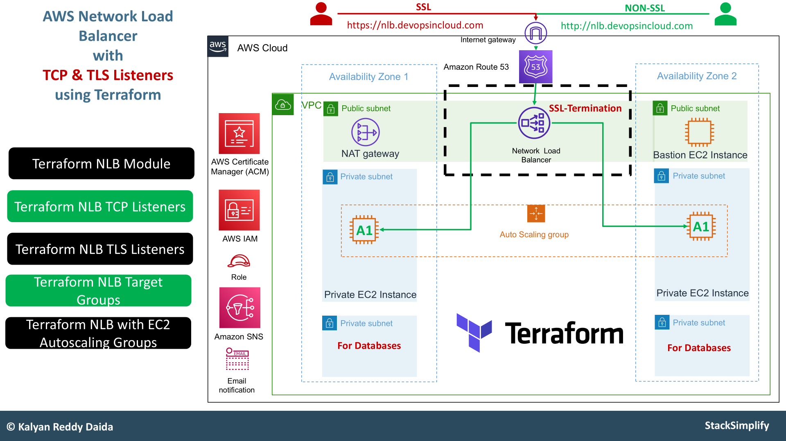

This series draws heavily from **Kalyan Reddy Daida**’s [Terraform on AWS with SRE & IaC DevOps](https://www.udemy.com/course/terraform-on-aws-with-sre-iac-devops-real-world-demos/) course on _Udemy_.

[His content](https://www.udemy.com/user/kalyan-reddy-9/) was a game-changer in helping me understand Terraform.

|About the instructor| |
| --- | --- |
| 🌐 [Website](https://stacksimplify.com/) | 📺 [YouTube](https://www.youtube.com/stacksimplify) |
| 💼 [LinkedIn](https://www.linkedin.com/in/kalyan-reddy-daida) | 🗃️ [GitHub](https://github.com/stacksimplify)                                                                                                  |

Details about the course on my website: [Terraform on AWS with SRE & IaC DevOps](https://rtdevx.github.io/posts/training/terraform/terraform-on-aws-with-sre--iac-devops/)

<h2>In this section:</h2>
